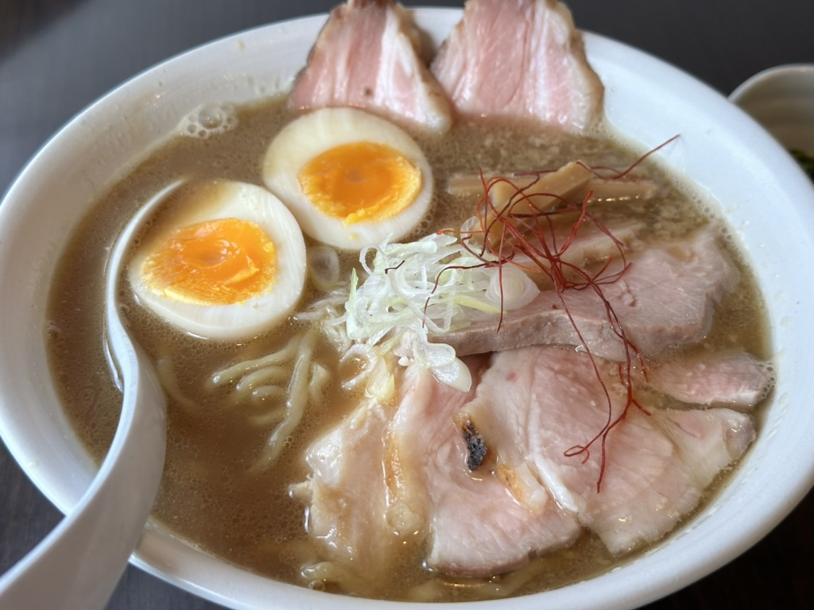

+++
date = '2025-04-11T10:06:10+09:00'
draft = true
title = 'Test1'
+++
## ラーメン日記1

名工大から徒歩10分ほどの場所にある、[らーめん奏](https://x.com/rmnknd)を訪れました。

厳選された素材を使った無化調ラーメンが売りのお店で、こだわりのスープ、国産小麦100%の自家製麺、低温調理されたプリプリのチャーシューが絶品です。

今回は、煮干しチャーシュー麺にスペシャルトッピング(煮卵、チャーシュー、海苔)を追加していただきました。

毎日行列ができるほどの人気店で、ラーメン百名店にも選ばれています。

営業時間は昼の11:30~14:00と短めで、火曜はお休みです。

3コマ目が空いている日に、時間に余裕を持って訪れてみてください！(13時以降がおすすめです！)


- 食券制  
- カウンター席/テーブル席(1台のみ)
- お水はセルフサービス  
- 営業時間：11:30〜14:00（火曜定休）  
- 駐車場有
- 名工大から徒歩約10分  


